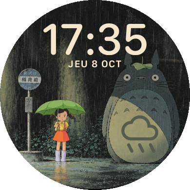

# Cadran Totoro pour Garmin Forerunner 165

Cadran Connect IQ sur la scène de l'arrêt de bus sous la pluie de *Mon voisin Totoro*,
pour la Forerunner 165 et la Forerunner 165 Music (écran AMOLED rond 390 × 390).

<p align="center"></p>

## Fonctionnalités

- **Heure** centrée en haut, au format 24 h ou 12 h selon les réglages de la montre.
- **Date** en français et en capitales, par exemple « JEU 8 OCT ».
- **Météo** au milieu du ventre de Totoro : 9 icônes (soleil, éclaircies, nuages, pluie,
  neige, orage, brouillard), avec une lune entre 20 h et 7 h. Les données viennent de
  Garmin Connect sur le téléphone ; sans météo disponible, l'icône est masquée.
- **Batterie** : le parapluie de Satsuki passe du vert (100 %) au rouge d'origine (0 %),
  par paliers de 10 %.
- **Always-on** (réglage *Toujours activé* de la montre) : dessin au trait de la scène et
  heure seule, légèrement décalée chaque minute contre le marquage de l'écran.

## Structure

```
manifest.xml, monkey.jungle    Projet Connect IQ (fr165, fr165m)
source/
  TotoroApp.mc                 Point d'entrée
  TotoroView.mc                Dessin du cadran (normal et always-on)
  DataProvider.mc              Batterie et météo
resources/
  layout/layout.json           Positions, partagées entre le cadran et les scripts
  drawables/                   Fond, always-on, icônes météo, parapluies
  fonts/                       Polices bitmap de l'heure et de la date
tools/
  prepare_images.py            Génère les images à partir de l'illustration
  make_fonts.py                Génère les polices bitmap
```

## Prérequis

- [Connect IQ SDK](https://developer.garmin.com/connect-iq/sdk/) installé avec le SDK Manager,
  avec les appareils **Forerunner 165** et **Forerunner 165 Music**.
- Une clé développeur `developer_key` à la racine du dépôt (extension VS Code Monkey C :
  *Generate a Developer Key*). Elle est exclue du dépôt par le `.gitignore`.
- Pour régénérer les ressources : Python 3 et [Pillow](https://pypi.org/project/Pillow/), sur macOS
  (les polices sont tirées de SF Compact Rounded, fournie avec le système).

## Compiler et tester

```sh
SDK=$(cat ~/Library/Application\ Support/Garmin/ConnectIQ/current-sdk.cfg)

# Version de test
"$SDK/bin/monkeyc" -f monkey.jungle -d fr165 -y developer_key -o bin/totoro-fr165.prg -w -l 3

# Simulateur
"$SDK/bin/connectiq" &
"$SDK/bin/monkeydo" bin/totoro-fr165.prg fr165

# Version à installer sur la montre (remplacer fr165 par fr165m pour la version Music)
"$SDK/bin/monkeyc" -f monkey.jungle -d fr165 -y developer_key -o bin/release/Totoro-fr165.prg -r -O 2 -w -l 3
```

Dans le simulateur, le menu de simulation permet de changer la batterie, la météo et le
format de l'heure, et *Settings > Low Power Mode* affiche le mode always-on.

## Installer sur la montre

1. Brancher la montre au Mac en USB et ouvrir [OpenMTP](https://openmtp.ganeshrvel.com/)
   (quitter Garmin Express s'il est ouvert).
2. Copier `bin/release/Totoro-fr165.prg` (ou `Totoro-fr165m.prg`) dans `GARMIN/APPS`,
   en remplaçant l'ancienne version.
3. Débrancher la montre, puis choisir le cadran **Totoro** dans *Cadran de montre*.

## Régénérer les ressources

Les ressources générées sont commitées : il n'est nécessaire de relancer les scripts qu'après
une modification de l'illustration, du cadrage, des polices ou de `layout.json`.

```sh
python3 tools/make_fonts.py
python3 tools/prepare_images.py scene totoro_satsuki_background.png 622 709 1026
python3 tools/prepare_images.py icons    # toujours après « scene »
```

- `scene` découpe l'illustration (centre `622 709`, côté `1026` px) et génère le fond, le
  dessin always-on, l'icône de lancement et les 11 parapluies.
- `icons` génère les icônes météo ([Material Symbols Rounded](https://github.com/google/material-design-icons),
  police téléchargée au premier lancement dans `bin/cache/`). Leurs bords sont mélangés avec le
  fond à leur emplacement : il faut relancer `icons` après avoir déplacé la météo.

Les réglages courants se trouvent dans `resources/layout/layout.json` (positions) et en tête de
`tools/prepare_images.py` (taille et couleur des icônes, couleurs du parapluie).

## Licences et crédits

- **Illustrations** : la scène vient de *Mon voisin Totoro* (Studio Ghibli) ; le fond utilisé a
  été redessiné avec ChatGPT à partir de cette scène. Ces images et tout ce qui en dérive
  (fond, always-on, parapluies, icône de lancement) sont réservés à un **usage personnel** et
  ne doivent pas être redistribués. Le dépôt reste privé pour cette raison.
- **Polices** : générées à partir de SF Compact Rounded (Apple), dont la licence n'autorise
  pas la redistribution.
- **Icônes météo** : [Material Symbols](https://github.com/google/material-design-icons) de
  Google, sous licence Apache 2.0.
